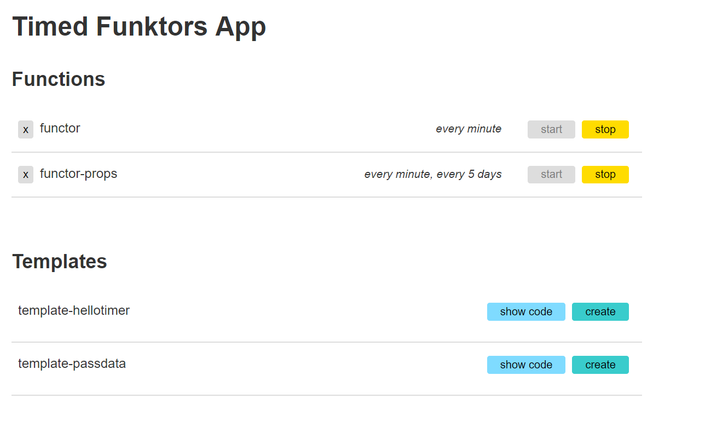

# Introduction 
Manage, Monitor and dynamically Create scheduled Azure Functions.



# Getting Started
In order to run the sample you will need to download the [Azure](https://azure.github.io/projects/clis/) and [Azure Function](https://github.com/Azure/azure-functions-cli) CLIs. To install these run the following lines of code:
- `curl -L https://aka.ms/InstallAzureCli | bash`
- `npm i -g azure-functions-core-tools`

## Setting up Subscription

- `az account set --subscription <your-subscription-id>`

- `az login`

## Create Azure Storage Account and Azure Function

- `az storage account create --name <storage_name> --location westeurope --resource-group myResourceGroup --sku Standard_LRS`

- `az functionapp create --name funkDemo2 --storage-account funkstorage  --resource-group demoTest2 --consumption-plan-location eastus2`

If at any point you see this error: `Sequence contains no elements` try logging out and logging in using `az func logout` and then `az func login` and enter your Azure credentials..

## Update Application settings
You will need to create a service principal to access your Function app at the resource group level.  Create a new service principle:

```bash
az ad sp create-for-rbac -n <name-of-service-principal> --scopes /subscriptions/<your-subscription-id>/resourceGroups/<your-resource-group->  --role Owner
```

Your output will look like:

```
{
  "appId": "xxxxxx-xxxx-xxxx-xxxx-6efb73bdxxxx",  //client id
  "displayName": "funkysp",
  "name": "http://funkysp",
  "password": "7408xxxx-xxxx-xxxx-xxxx-xxxxxx246cee", //client secret
  "tenant": "4648xxxx-xxxx-xxxx-xxxx-xxxx229cxxxx" // domain
}
```

You'll need to use that output to set your function app's application settings in order to connect to your desired function app. You can find an example settings file in `functions/example.settings.json`. 

You can make a copy of ```example.settings.json``` to ```local.settings.json``` by:

```
cp example.settings.json local.settings.json
```

Enter the following credentials in `local.settings.json`:

+ `FUNCTION_APP_NAME` - the name of your function app
+ `FUNCTION_APP_RESOURCE_GROUP` - the resource group of your function app
+ `SUBSCRIPTION_ID` -  the subscription id of your function app
+ `CLIENT_ID` - the application id of the service principal when it was created
+ `CLIENT_SECRET` - the password property returned to you when the service principal was created
+ `DOMAIN` - the tenant property returned to you when the service principal was created


### Run the test sample
- `cd test\sample`
- `func azure functionapp fetch-app-settings <your func name>`
- `func host start`

# Building and running the frontend

The frontend runs on Webpack bundling. There are some npm scripts you can run while developing.

To build:

1. `cd frontend`
2. `npm install`
3. `npm run build`

If you'd like to actively develop the frontend, use `npm run watch` instead, which will recompile all javascript every time you make a change in any frontend javascript file.

In an additional terminal pane / window / tab, run a local server instance to serve the index.html file and the assets. I use `http-server` as it's quick to run, but python's `SimpleHTTPServer` will also do if you prefer that.

To use `http-server`:

1. `npm install -g http-server`
2. `cd frontend`
3. `http-server`
4. Open a browser and navigate to the url output in the terminal after running `http-server` and you should see the app running.

# Build and Test

# Contribute
